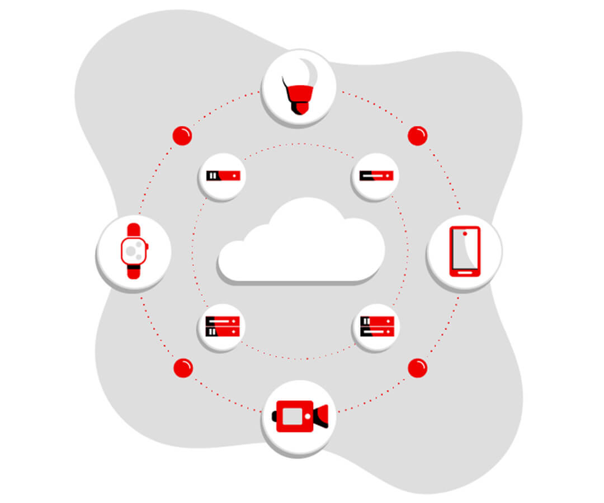

# Internet de las cosas

## ¿Qué es IoT (Internet of things)?

La Internet de las cosas (IoT) se refiere a la red de objetos físicos equipados con sensores, software y otras tecnologías que les permiten conectarse e intercambiar datos con otros dispositivos y sistemas a través de Internet. Estos objetos pueden variar desde aparatos domésticos comunes hasta equipos industriales avanzados. Actualmente, existen más de 7 mil millones de dispositivos IoT conectados, y se proyecta que esta cifra alcance los 10 mil millones en 2020 y los 22 mil millones para 2025.

En los últimos años, el IoT ha emergido como una de las tecnologías más revolucionarias del siglo XXI. Gracias a los dispositivos integrados, es posible conectar a Internet objetos cotidianos como electrodomésticos, automóviles, termostatos e incluso monitores para bebés, facilitando una comunicación fluida entre personas, procesos y dispositivos.

Con el apoyo de tecnologías como la computación de bajo costo, la nube, el big data, la analítica y las soluciones móviles, los dispositivos físicos pueden recopilar y compartir información con un mínimo de intervención humana. En este ecosistema hiperconectado, los sistemas digitales son capaces de registrar, supervisar y optimizar las interacciones entre los dispositivos conectados, creando una integración dinámica entre el mundo físico y el digital.

---

## ¿Qué hace posible su funcionamiento?

Aunque la idea del Internet de las cosas (IoT) ha existido durante décadas, una serie de avances tecnológicos recientes la ha convertido en una realidad práctica:

- Sensores económicos y de bajo consumo: La disponibilidad de sensores asequibles y confiables ha facilitado que más fabricantes adopten la tecnología IoT.
- Conectividad mejorada: La amplia variedad de protocolos de red para Internet ha simplificado la conexión de sensores a la nube y a otros dispositivos, permitiendo una transferencia de datos eficiente.
- Plataformas de computación en la nube: El acceso cada vez mayor a plataformas en la nube brinda a empresas y consumidores la infraestructura necesaria para escalar sus operaciones sin la complejidad de gestionarla completamente por su cuenta.
- Avances en aprendizaje automático y análisis de datos: Gracias a estas tecnologías, junto con el acceso a grandes volúmenes de datos almacenados en la nube, las empresas pueden obtener insights de manera más rápida y sencilla. Por un lado, el IoT impulsa el desarrollo de estas herramientas; por otro, los datos generados por IoT alimentan a su vez su evolución.
- Inteligencia artificial conversacional: Los progresos en redes neuronales han mejorado significativamente el procesamiento del lenguaje natural (PLN), integrando esta capacidad en dispositivos IoT como asistentes virtuales (Alexa, Cortana, Siri). Esto los ha hecho más atractivos, accesibles y útiles para el hogar.

Estos avances no solo están expandiendo los límites del IoT, sino que también están transformando su impacto en la vida cotidiana y en las industrias.

---

## ¿Qué es IoT industrial?

El Internet de las cosas industrial (IIoT, por sus siglas en inglés) se refiere a la implementación de tecnología IoT en entornos industriales, enfocándose en la instrumentación, el control de sensores y dispositivos, y el uso de tecnologías en la nube. Tradicionalmente, las industrias han empleado la comunicación máquina a máquina (M2M) para habilitar la automatización y el control inalámbrico. Sin embargo, con la llegada de tecnologías avanzadas como la nube, la analítica y el aprendizaje automático, ahora es posible alcanzar un nivel superior de automatización, lo que permite crear nuevos modelos de negocio e incrementar las fuentes de ingresos.

El IIoT también es conocido como la cuarta ola de la revolución industrial o Industria 4.0. Entre sus aplicaciones más destacadas se encuentran:

- Fabricación inteligente
- Gestión de activos conectados y mantenimiento preventivo y predictivo
- Redes eléctricas inteligentes
- Ciudades inteligentes
- Logística conectada
- Cadenas de suministro digitales avanzadas

---

[Fuente](https://www.oracle.com/mx/internet-of-things/)
