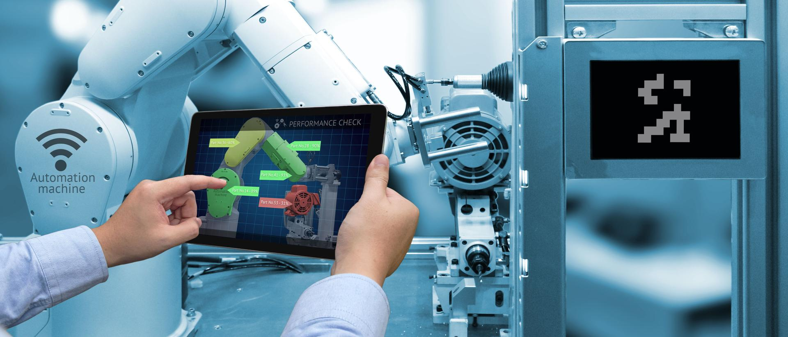
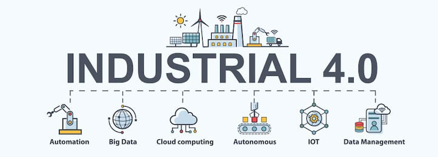

# IIOT e Industria 4.0

Las iniciativas actuales de la Industria 4.0 también buscan desarrollar colaboraciones simbióticas y gratificantes entre las personas y la tecnología. Cuando la precisión y la velocidad de las herramientas 4.0 se combinan con la creatividad, el talento y la innovación de su personal, usted obtiene beneficios tanto para su fuerza laboral como para sus resultados finales. Sus operaciones de fabricación se vuelven más eficientes y productivas, y sus equipos son relevados de muchas tareas mundanas y repetitivas –dándoles la oportunidad de colaborar con tecnologías inteligentes y equiparse mejor para el entorno tecnológico en evolución y el futuro del trabajo impulsado por la IA–. 

Una concepto con similar significado es la IoT industrial, que consiste en maquinaria conectada a Internet y en avanzadas plataformas de análisis que procesan los datos que se producen. Los dispositivos IIoT van desde diminutos sensores ambientales hasta complejos robots industriales.

  

---

## Diferencia entre el IoT y el IIoT

El IoT industrial es una subcategoría del Internet de las cosas, que también incluye aplicaciones orientadas al consumidor, como dispositivos portátiles, tecnología doméstica inteligente y automóviles sin conductor. La característica distintiva de ambos conceptos es la infraestructura, los sensores integrados en las máquinas y los dispositivos transmiten datos a través de Internet y se gestionan mediante software.

---

## ¿Por qué utilizar el IoT industrial? 

Para cualquier negocio que se dedique a la producción y el transporte de bienes físicos, el IIoT puede crear procesos eficientes que innovan las tareas operativas y puede presentar modelos empresariales novedosos.

---

## Beneficios de la industria 4.0 

La Industria 4.0 representa algo más que una simple actualización tecnológica. Al eliminar los silos y conectar equipos y operaciones en todo su entorno de fabricación, se comienza a establecer una forma más transparente y holística de hacer negocios –que eventualmente puede extenderse a todas las áreas de su organización–.

La eficiencia operativa se mejora con una asignación de recursos mejorada, un tiempo de inactividad reducido y una mayor productividad. Esta eficiencia se extiende a las iniciativas de sostenibilidad en las que las analíticas y las automatizaciones inteligentes pueden ayudar a optimizar aún más el uso de energía, reducir los residuos e incluso diseñar e innovar productos que sean más sostenibles a lo largo de su ciclo de vida.

El hecho de que las soluciones y herramientas de la industria 4.0 le permitan recopilar, analizar e interpretar grandes cantidades de datos en tiempo real, significa que se puede obtener información estratégica accionable muy rápidamente, dándole el poder de tomar decisiones con confianza y precisión. Esto también se aplica a los clientes, porque sus demandas y expectativas también están cambiando a la velocidad de la luz. Por lo tanto, las analíticas de datos en tiempo real pueden ayudar a que adapte rápidamente para personalizar productos y brindar soluciones personalizadas on-demand.

Vivimos en tiempos competitivos y volátiles. Las herramientas y estrategias de la Industria 4.0 ayudan a mejorar no solo la eficiencia y la productividad, sino también la capacidad de ver en los rincones y obtener una ventaja competitiva significativa. Tecnologías como internet de las cosas industrial (IIoT), conectividad en la nube, IA y machine learning ahora están profundamente integradas en el proceso de fabricación. 

---

### Referencias

- [Fuente 1](https://www.hpe.com/mx/es/what-is/industrial-iot.html)
- [Fuente 2](https://www.sap.com/latinamerica/products/scm/industry-4-0/what-is-industry-4-0.html?url_id=text-lao-404-reclink)
