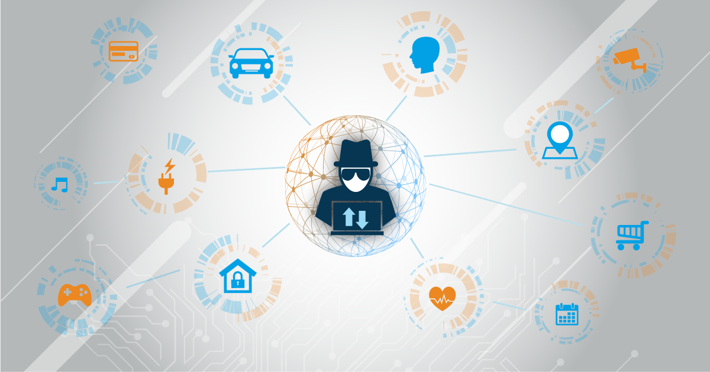

# Privacidad y seguridad

La **Internet de las Cosas (IoT)** enfrenta amenazas en tres categorías clave: **privacidad**, **protección** y **seguridad**. Estos riesgos son amplios y potencialmente devastadores, especialmente porque la IoT incluye infraestructuras críticas como hogares, vehículos, y sistemas energéticos. Además, los datos personales y contextuales que recopilan los dispositivos conectados son un objetivo atractivo para ciberdelincuentes y espionaje.

---

## **Amenazas reales en la IoT**

- **Infraestructuras vulnerables**: Controladores domésticos, como sistemas de calefacción o cerraduras, han sido hackeados para interrumpir servicios.
- **Equipos comunes comprometidos**: Cámaras de vigilancia, monitores infantiles e incluso bombillas inteligentes han sido usados en ataques masivos como DDoS.

La falta de seguridad en estos dispositivos compromete redes enteras, ya que los hackers pueden explotarlos para lanzar ataques a terceros.

---

## **Retos para el futuro**

A medida que los dispositivos IoT se vuelven más autónomos e interactúan entre sí, surgen riesgos complejos. Los errores de software, la falta de actualizaciones y la exposición física de los dispositivos agravan las amenazas. Los usuarios y organizaciones deben priorizar la seguridad al integrar dispositivos IoT en sus sistemas.

---

## **Soluciones posibles**

1. **Cifrado y autenticación**: Usar herramientas de protección como cifrado de datos y autenticación avanzada para usuarios.
2. **Segmentación de redes**: Separar los dispositivos IoT en redes independientes para minimizar daños en caso de compromisos.
3. **Estandarización de seguridad**: Exigir que los proveedores diseñen dispositivos con seguridad integrada, alineados con estándares como OWASP.
4. **Desarrollo seguro de software**: Mejorar la calidad del código y realizar análisis de amenazas durante el desarrollo.

Crear una IoT segura requiere un enfoque integral que considere la protección desde el diseño hasta la implementación.

---

### Referencias

- [Fuente](https://owasp.org/www-project-top-ten/)
- [Fuente](https://www.iotsecurityfoundation.org/)  
- [Fuente](https://www.nist.gov/)  
- [Fuente](https://www.bbvaopenmind.com/tecnologia/mundo-digital/internet-de-las-cosas-seguridad-privacidad-y-proteccion/)
