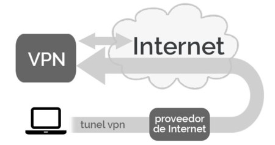

# Extensiones de seguridad perimetral.

## Redes Privadas Virtuales (VPNs).

Las VPNs garantizan conexiones seguras a través de Internet mediante cifrado, permitiendo que los usuarios trabajen de forma remota sin comprometer la seguridad de los datos corporativos.

El uso de VPNs se está ampliando para incluir protocolos como WireGuard, que ofrece mayor rendimiento y simplicidad en comparación con opciones tradicionales como IPsec y OpenVPN. Estas tecnologías garantizan la seguridad en entornos con alto volumen de trabajo remoto.

## Control de acceso y políticas de cero confianza.

El enfoque de "Zero Trust" está integrándose en las soluciones perimetrales. Este modelo asume que ninguna entidad, interna o externa, es de confianza a priori, verificando cada solicitud de acceso a recursos internos de forma continua.

## Filtrado de contenido y análisis.

Las herramientas avanzadas de filtrado de URL, DNS y video incluyen capacidades de inteligencia artificial para identificar contenido peligroso y bloquear sitios web comprometidos, ofreciendo una barrera preventiva contra el phishing y el malware; también se hace uso de técnicas como el modelado de tráfico (traffic shaping), que optimizan la seguridad y priorizan recursos críticos en la red.

[Fuente 1](https://learn.microsoft.com/en-us/azure/cloud-adoption-framework/ready/azure-best-practices/perimeter-networks)
[Fuente 2](https://edu.gcfglobal.org/es/seguridad-en-internet/que-es-la-seguridad-en-internet/1/)
[Fuente 3](https://redesinformaticas.org/)
