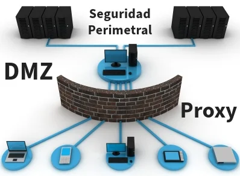

# Fundamentos de Redes Perimetrales.

## Definición y propósito.

Las redes perimetrales establecen una primera línea de defensa para proteger los activos digitales, previniendo accesos no autorizados y gestionando el tráfico de red entrante y saliente. Su objetivo es garantizar la seguridad y confiabilidad de las comunicaciones dentro de una infraestructura organizacional.

En otras palabras, las redes perimetrales protegen la infraestructura digital estableciendo barreras que controlan las conexiones externas. Esto implica implementar soluciones que identifican y filtran tráfico potencialmente dañino desde el exterior hacia la red interna. Este enfoque reduce el riesgo de ataques como el ransomware, las intrusiones y el acceso no autorizado.

## Componentes principales.

Los elementos clave incluyen firewalls, VPNs, sistemas de detección y prevención de intrusiones (IDS/IPS), y controles de acceso. Estos trabajan en conjunto para monitorear, analizar y bloquear amenazas antes de que afecten los sistemas internos.

Además de firewalls y VPNs, se incorporan sistemas como honeypots para detectar intrusos y tecnología de segmentación de redes (Network Segmentation), que organiza la infraestructura en segmentos independientes para limitar la propagación de amenazas.

[Fuente 1](https://learn.microsoft.com/en-us/azure/cloud-adoption-framework/ready/azure-best-practices/perimeter-networks)
[Fuente 2](https://edu.gcfglobal.org/es/seguridad-en-internet/que-es-la-seguridad-en-internet/1/)
[Fuente 3](https://redesinformaticas.org/)
