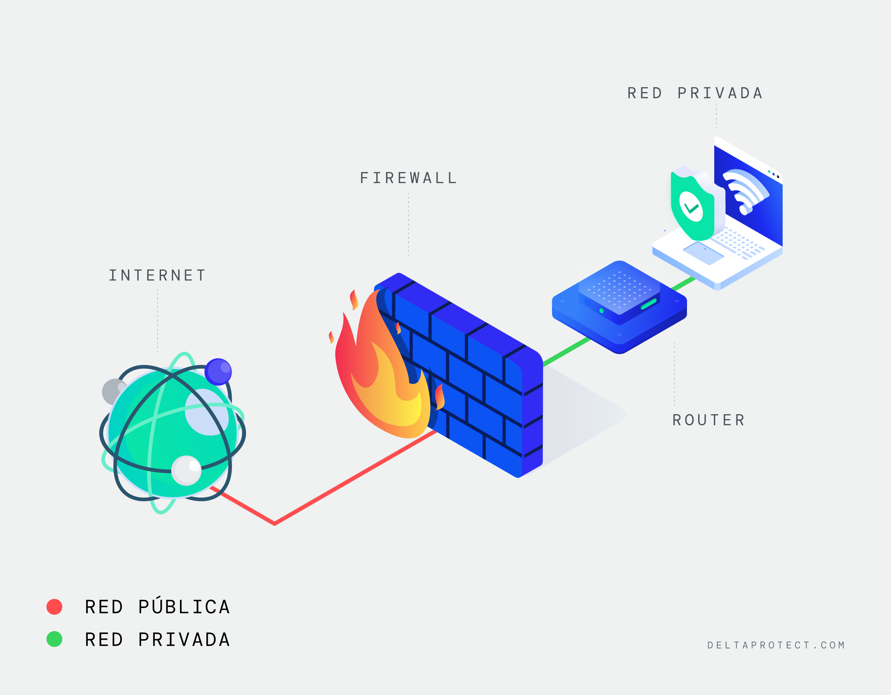
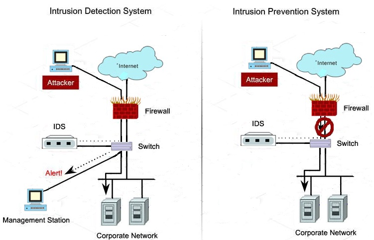

# Tecnologías y Herramientas de Seguridad Perimetral.

## Firewalls.

Los firewalls pueden ser de nivel de red o de aplicación, y se clasifican en personales y corporativos según su ámbito de uso. Además, los firewalls con estado (stateful firewalls) analizan el contexto de las conexiones para mejorar la seguridad.

Los firewalls de nueva generación (NGFW) combinan inspección profunda de paquetes, capacidades de detección de malware y gestión avanzada de aplicaciones. Estas funciones avanzadas permiten no solo bloquear amenazas, sino también analizar patrones de tráfico en tiempo real.

## Sistemas IDS/IPS.

Los IDS detectan actividades sospechosas y registran incidentes, mientras que los IPS actúan activamente para mitigar amenazas. Su integración con otros sistemas mejora la capacidad de respuesta ante intrusiones.

Los sistemas de detección y prevención de intrusiones se benefician de tecnologías emergentes como la inteligencia artificial, que les permite identificar patrones de ataque más complejos y adaptarse dinámicamente a nuevas amenazas.

## Seguridad basada en contexto.

La contextualización del tráfico permite a las soluciones perimetrales considerar factores como la ubicación, el dispositivo y el tipo de aplicación para tomar decisiones más informadas sobre la seguridad del acceso.

[Fuente 1](https://learn.microsoft.com/en-us/azure/cloud-adoption-framework/ready/azure-best-practices/perimeter-networks)
[Fuente 2](https://edu.gcfglobal.org/es/seguridad-en-internet/que-es-la-seguridad-en-internet/1/)
[Fuente 3](https://redesinformaticas.org/)