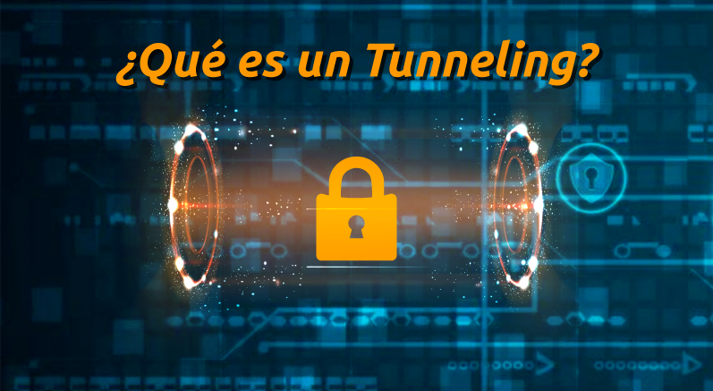

# Establecimiento de un enlace seguro de red: Tunelización (Tunneling)

En el mundo digital actual, donde los ataques cibernéticos son cada vez más frecuentes y sofisticados, establecer conexiones seguras se ha vuelto esencial para proteger la confidencialidad e integridad de los datos. La tunelización, o tunneling, es una técnica clave que encapsula un protocolo de comunicación dentro de otro, creando un "túnel" seguro que permite transmitir información privada a través de redes públicas como Internet. Si quieres entender cómo funciona la tunelización, por qué es esencial para la seguridad digital sigue leyendo este artículo.

La tunelización, también conocida como tunneling, es una técnica de red que encapsula un protocolo de comunicación dentro de otro, formando un "túnel" virtual que permite transmitir datos de manera segura y privada a través de redes públicas, como Internet. Este proceso protege la información mediante cifrado y encapsulación, garantizando que los datos lleguen a su destino sin ser interceptados o alterados. La tunelización es fundamental para establecer enlaces seguros, especialmente en aplicaciones como Redes Privadas Virtuales (VPN), que aseguran conexiones confiables para empresas y usuarios individuales en entornos digitales.

## Características principales de la tunelización:

### Encapsulación
Los datos se encapsulan en un formato que puede ser transportado por un protocolo subyacente. Por ejemplo, datos privados pueden encapsularse dentro del protocolo TCP/IP. Al encapsular los datos en un túnel, se añade una capa de protección contra la manipulación no autorizada. Esto asegura que los datos no sean alterados durante su tránsito, manteniendo su integridad.
### Cifrado
Muchas implementaciones de tunelización utilizan cifrado para proteger la confidencialidad e integridad de los datos. Al utilizar la tunelización, los usuarios pueden ocultar su identidad y ubicación real a cualquier entidad no autorizada que intente interceptar la comunicación.
### Extensibilidad
Permite transmitir datos de protocolos no nativos a través de redes que no los soportan directamente.

## Protocolos Comunes de Tunelización

### VPN (Red Privada Virtual):

Las VPN son quizás el método más conocido de implementar la tunelización. La tecnología VPN crea túneles seguros entre dispositivos o redes a través de Internet. Utiliza protocolos como OpenVPN, L2TP/IPsec, o WireGuard para encapsular y cifrar los datos.

### SSH (Secure Shell):

SSH crea túneles cifrados entre dispositivos para transmitir datos de manera segura, especialmente utilizado para la administración remota de sistemas y tunelización de servicios (como bases de datos o navegadores web). Proporciona una capa adicional de seguridad al cifrar las comunicaciones.

### IPsec (Protocolo de Seguridad de Internet):

IPsec es un conjunto de protocolos diseñados para autenticar y cifrar paquetes IP, creando túneles seguros entre dispositivos. Es ampliamente utilizado para conexiones punto a punto y VPNs. Puede utilizarse en modo túnel para crear conexiones seguras entre redes o en modo transporte para asegurar las comunicaciones entre dispositivos individuales.

## Implementaciones en el Mundo Real

### Streaming

La tunelización se utiliza ampliamente en servicios de streaming para sortear restricciones geográficas. Por ejemplo, usuarios en regiones donde ciertos contenidos están bloqueados pueden acceder a ellos mediante VPNs que crean túneles seguros y asignan una dirección IP de otra ubicación. Esto permite a los usuarios disfrutar de catálogos completos de plataformas como Netflix o Disney+ mientras protegen su privacidad y datos.

### Videojuegos

En el ámbito de los videojuegos, la tunelización ayuda a reducir la latencia y mejorar la estabilidad de las conexiones en partidas en línea. Herramientas como VPNs optimizadas para gaming permiten evitar restricciones impuestas por regiones, proteger contra ataques DDoS y conectarse a servidores más rápidos, ofreciendo una experiencia de juego más fluida y segura.

### Organizaciones

Empresas y organizaciones utilizan tunelización para conectar sucursales remotas de manera segura. Las VPNs corporativas permiten que los empleados accedan a la red interna de la empresa desde cualquier lugar, garantizando el cifrado de datos sensibles. Además, estas soluciones son esenciales para proteger comunicaciones en entornos de trabajo híbrido o remoto.

## Conclusión

La tunelización es una tecnología versátil que ha transformado la forma en que se manejan las conexiones digitales, ofreciendo seguridad, privacidad y accesibilidad en diferentes escenarios. Desde el acceso a contenidos restringidos y la mejora de la experiencia de juego hasta la protección de datos empresariales, esta herramienta se ha convertido en un pilar esencial en un mundo cada vez más interconectado y lleno de desafíos digitales.

[Fuente 1](https://latam.kaspersky.com/resource-center/definitions/tunneling-protocol)
[Fuente 2](https://www.cloudflare.com/es-es/learning/network-layer/what-is-tunneling/)