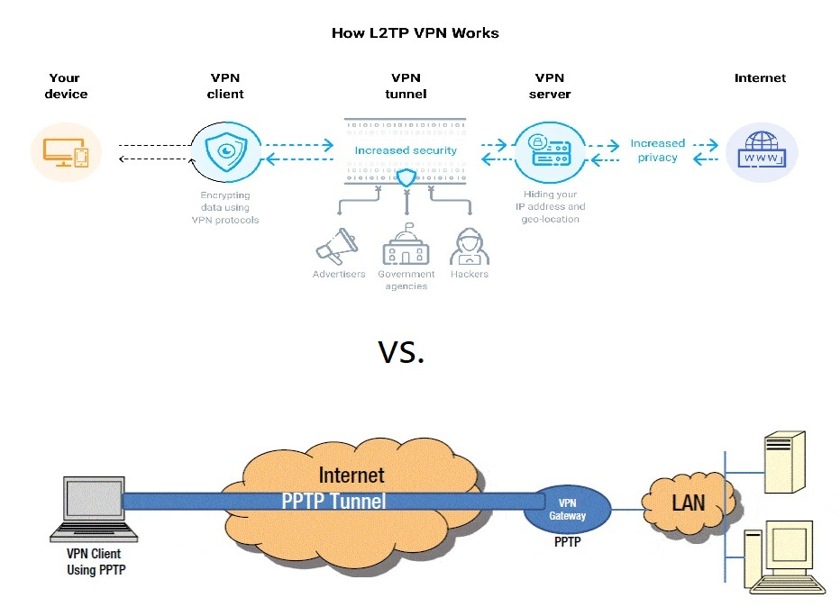

# Point to Point Tunneling Protocol

PPTP (Point to Point Tunneling Protocol) protocolo de tunelización de punto a punto. El PPTP, que opera en el puerto TCP 1723, es uno de los protocolos VPN más antiguos en uso; es uno de los más comunes, más fáciles de configurar, y computacionalmente rápidos.

## Antecedentes

Antes de profundizar en los aspectos técnicos, es importante conocer su origen. El PPTP (Protocolo de Túnel Punto a Punto) fue creado por Microsoft en la década de los 90 y, desde entonces, ha desempeñado un papel clave en el establecimiento de conexiones seguras a través de redes.

Cabe destacar que el PPTP VPN fue una de las primeras soluciones de este tipo en ganar popularidad. Aunque con el tiempo han surgido opciones más seguras, su relevancia persiste debido a su facilidad de uso y rapidez.

---

## Funcionamiento

El protocolo PPTP funciona estableciendo un "túnel" virtual entre dos puntos dentro de una red, similar a un canal privado por donde fluye la información. Este túnel permite que los datos viajen de manera protegida y aislada, lo que dificulta que terceros puedan interceptarlos o acceder a ellos.
Cuando se utiliza una VPN basada en PPTP, los datos se encapsulan dentro de paquetes que luego son cifrados antes de ser enviados a través de la red. Una vez que los datos llegan al destino, se descifran y se extraen del túnel. Este proceso permite mantener la privacidad incluso en redes públicas o no confiables, como redes Wi-Fi abiertas.
El protocolo PPTP emplea el puerto TCP 1723 para establecer la conexión y utiliza el protocolo GRE (Generic Routing Encapsulation) para encapsular los datos. Aunque su cifrado es básico en comparación con estándares más modernos, sigue siendo eficiente en términos de velocidad, lo que lo hace adecuado para aplicaciones donde el rendimiento es una prioridad. Sin embargo, su nivel de seguridad es limitado debido a vulnerabilidades en sus métodos de autenticación.

---

## PPTP en la vida diaria

En la vida cotidiana, PPTP se utiliza principalmente para facilitar el acceso remoto y proteger la privacidad en línea. Por ejemplo, si necesitas conectarte a los recursos de tu oficina desde casa, una conexión VPN basada en PPTP puede permitirte hacerlo como si estuvieras físicamente en la red corporativa. Además, muchas personas recurren a PPTP para navegar de forma anónima, ocultando su ubicación real y encriptando su tráfico en redes públicas, como en cafeterías o aeropuertos.

Aunque no es tan robusto en términos de seguridad como los protocolos más modernos, su facilidad de configuración y velocidad lo hacen una opción práctica para tareas como transmisión de contenido multimedia, acceso remoto a archivos, o para dispositivos más antiguos que requieren soluciones de bajo consumo de recursos. Sin embargo, es importante considerar alternativas más seguras cuando se manejan datos sensibles.

---

## Alternativas

Aunque PPTP es conocido por su simplicidad, existen otros protocolos que ofrecen mayor seguridad. Algunos de estos son:

- L2TP/IPsec: combina las mejores características del PPTP y del protocolo L2F. Ofrece una seguridad robusta, aunque puede ser un poco más lento debido a su doble cifrado.
- OpenVPN: es una solución de código abierto que es altamente configurable y se considera muy segura. Sin embargo, puede requerir software adicional y una configuración más detallada.
- SSTP: desarrollado por Microsoft, este protocolo es similar al PPTP pero con un cifrado más fuerte. Es ideal para usuarios de Windows, ya que está integrado en el sistema operativo.

[Fuente](https://www.revistacloudcomputing.com/2023/10/que-es-el-protocolo-de-vpn-pptp-y-para-que-sirve/#como-funciona-el-pptp)
