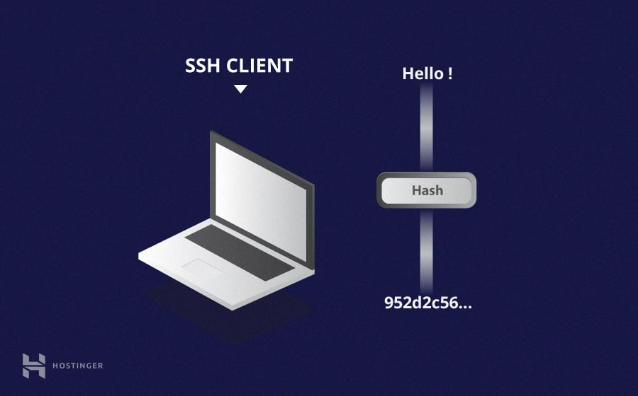
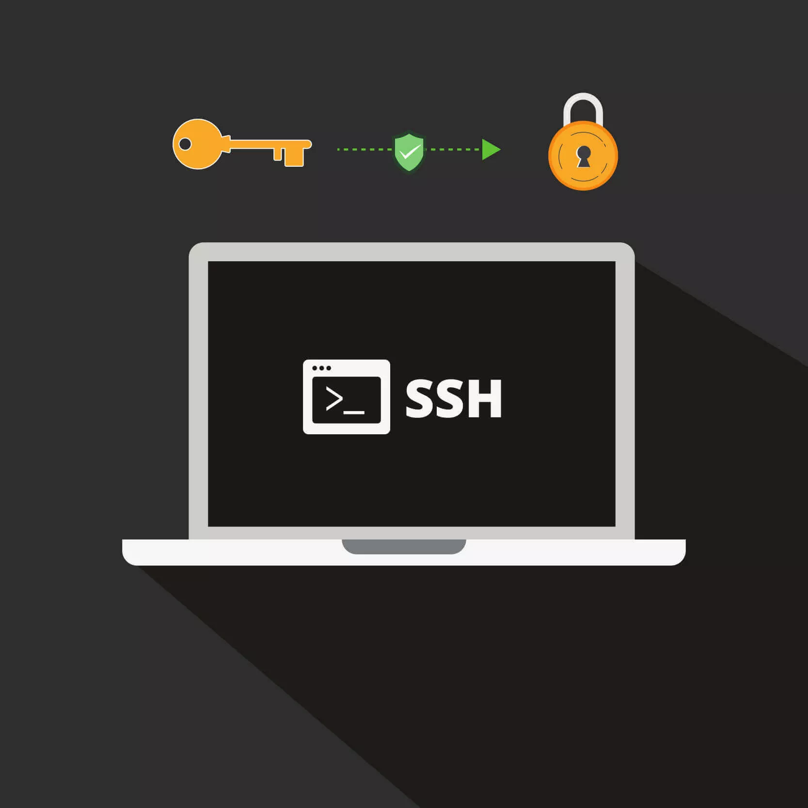

# SSH

SSH son las siglas de Secure Shell y es un protocolo de red destinado principalmente a la conexión con máquinas a las que accedemos por línea de comandos. En otras palabras, con SSH podemos conectarnos con servidores usando la red Internet como vía para las comunicaciones. Proporciona un mecanismo para autenticar un usuario remoto, transferir entradas desde el cliente al host y retransmitir la salida de vuelta al cliente. El servicio se creó como un reemplazo seguro para el Telnet sin cifrar y utiliza técnicas criptográficas para garantizar que todas las comunicaciones hacia y desde el servidor remoto sucedan de manera encriptada.

## ¿Cómo funciona SSH?

El SSH se ejecuta sobre el conjunto de protocolos TCP/IP y  utiliza una arquitectura cliente-servidor para establecer conexiones seguras. Aquí hay un resumen de cómo funciona:

* Cliente SSH: Es la aplicación que utilizas para conectarte a un servidor remoto. Puedes utilizar diferentes clientes SSH, como OpenSSH en sistemas Linux o PuTTY en Windows.
* Servidor SSH: Se ejecuta en el servidor remoto al que deseas acceder. Este servidor está configurado para aceptar conexiones SSH y autenticar a los usuarios.
* Autenticación: Cuando intentas conectarte a un servidor remoto, el cliente SSH y el servidor SSH inician un proceso de autenticación. Esto generalmente implica el uso de un nombre de usuario y una contraseña (o una clave SSH). La clave SSH es una forma más segura de autenticación y se recomienda encarecidamente su uso.

## Técncias de cifrado

La ventaja significativa ofrecida por el protocolo SSH sobre sus predecesores es el uso del cifrado para asegurar la transferencia segura de información entre el host y el cliente. Hay tres tecnologías de cifrado diferentes utilizadas por SSH:

1. **Cifrado simétrico:** es un método en el que la misma clave se utiliza tanto para cifrar como para descifrar la información. En este enfoque, tanto el remitente como el destinatario comparten una clave secreta, y esta clave se utiliza para proteger la confidencialidad de los datos. Los algoritmos de cifrado simétrico son eficientes y rápidos, pero el principal desafío radica en la distribución segura de la clave entre las partes involucradas.

2. **Cifrado asimétrico:** también conocido como cifrado de clave pública, utiliza un par de claves: una clave pública y una clave privada. La clave pública se comparte abiertamente y se utiliza para cifrar los datos, mientras que la clave privada, que solo el destinatario posee, se utiliza para descifrarlos. Este enfoque supera el desafío de la distribución segura de claves del cifrado simétrico y proporciona una mayor seguridad en términos de autenticidad y confidencialidad.

3. **Hashing:** es un proceso mediante el cual se toma una cantidad de datos y se produce una cadena de caracteres (hash) fija y única. Es una función unidireccional, lo que significa que no se puede recuperar la información original a partir del hash. Además, una pequeña modificación en los datos originales resulta en un hash completamente diferente. El hashing se utiliza comúnmente para verificar la integridad de los datos y almacenar contraseñas de forma segura. Un buen algoritmo de hashing produce hashes únicos y no reversibles.

## ¿Qué puerto utiliza SSH?

El puerto 22 es el puerto por defecto para el SSH. A veces, los firewalls pueden bloquear el acceso a determinados puertos en los servidores detrás del firewall, pero dejar abierto el puerto 22. Por lo tanto, el SSH es útil para acceder a los servidores situados al otro lado del firewall: los paquetes dirigidos al puerto 22 no se bloquean y pueden reenviarse a cualquier otro puerto.

El cliente debe iniciar la conexión SSH iniciando el protocolo TCP con el servidor, asegurando una conexión simétrica segura, verificando si la identidad mostrada por el servidor coincide con los registros anteriores (normalmente grabados en un archivo de almacén de claves RSA) y presenta las credenciales de usuario necesarias para autenticar la conexión.

Hay dos etapas para establecer una conexión: primero ambos sistemas deben acordar estándares de cifrado para proteger futuras comunicaciones, y segundo, el usuario debe autenticarse. Si las credenciales coinciden, se concede acceso al usuario.

### Autenticación del usuario

La etapa final antes de que se conceda al usuario acceso al servidor es la autenticación de sus credenciales. Para ello, la mayoría de los usuarios de SSH utilizan una contraseña. Se le pide al usuario que introduzca el nombre de usuario, seguido de la contraseña. Estas credenciales pasan con seguridad a través del túnel cifrado simétricamente, así que no hay ninguna posibilidad de que sean capturadas por un tercero.

Aunque las contraseñas se cifran, todavía no se recomienda usar contraseñas para conexiones seguras. Esto se debe a que muchos robots pueden simplemente realizar ataque de fuerza bruta para descifrar contraseñas fáciles o predeterminadas y así obtener acceso a tu cuenta. En vez de eso, la alternativa recomendada es un par de claves SSH. Se trata de un conjunto de claves asimétricas utilizadas para autenticar al usuario sin necesidad de introducir ninguna contraseña.

### Conclusiones
En resumen, SSH es una herramienta esencial que permite a los administradores gestionar sistemas de forma remota, transferir archivos de manera segura y realizar tareas de mantenimiento, lo que es esencial en el ámbito de la administración de servidores.

Además, su relevancia se extiende hasta la gestión de dominios y el hosting web, ya que ofrece a los administradores la capacidad de configurar servidores de alojamiento, manejar bases de datos y garantizar la seguridad al crear una página web.

[Fuente 1 ](https://www.arsys.es/blog/ssh) 
[Fuente 2 ](https://www.hostinger.mx/tutoriales/que-es-ssh) 
[Fuente 3 ](https://www.cloudflare.com/es-es/learning/access-management/what-is-ssh/) 
