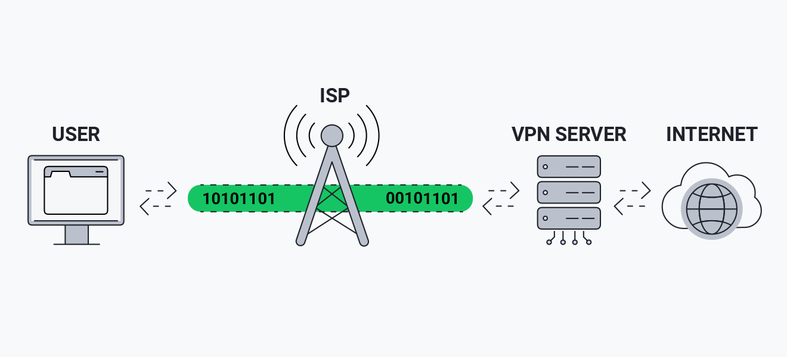
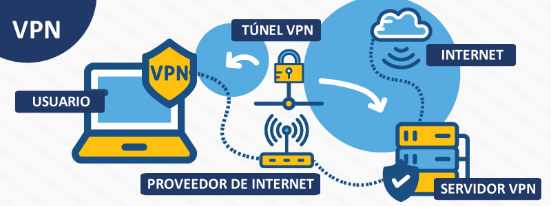

# VPN

Una VPN (Red Privada Virtual) es como un túnel secreto que protege tus datos mientras navegas por Internet. Básicamente, en lugar de que tu información viaje directamente por la red (donde puede ser interceptada por hackers o curiosos), una VPN la cifra y la envía a través de un servidor seguro antes de llegar a su destino. Esto no solo protege tu privacidad, sino que también te permite cambiar tu ubicación virtual

## ¿Cómo funciona una VPN?

Una VPN crea un "túnel" por donde puede enviar datos, este túnel garantiza que los datos transmitidos estén protegidos contra posibles interceptaciones. En lugar de comunicarse directamente con los sitios web o servicios en línea, tu conexión se enruta primero a través del servidor VPN, que oculta tu dirección IP real y asigna una nueva. Además, la información que viaja por este túnel está cifrada, lo que asegura que sea ilegible para terceros, como hackers, proveedores de servicios de Internet o incluso gobiernos.

## ¿Para que sirve?

Los servicios de VPN se utilizan principalmente para enviar datos de forma segura a través de Internet. Las tres funciones principales de las VPN son:

### Privacidad

Sin una red privada virtual, se puede acceder a sus datos personales, como contraseñas, información de tarjetas de crédito e historial de navegación, y venderlos a terceros. Las VPN utilizan el cifrado para mantener la privacidad de esta información confidencial, en especial cuando se conecta a través de redes wifi públicas. 

### Anonimato

Su dirección IP contiene información sobre su ubicación y su actividad de navegación. Todos los sitios web de Internet rastrean estos datos por medio de las cookies y otras tecnologías similares. Pueden identificarlo cada vez que los visite. Una conexión VPN oculta su dirección IP para que permanezca en el anonimato en Internet.

### Seguridad

Las VPN utilizan la criptografía para proteger su conexión a Internet de accesos no autorizados. También puede actuar como mecanismo de cierre, al finalizar programas preseleccionados en caso de actividad sospechosa en Internet. Esto disminuye la probabilidad de que los datos se vean comprometidos. Estas características permiten a las empresas dar acceso remoto a los usuarios autorizados a través de sus redes empresariales.

## ¿Como utilizar una VPN?

Hay dos formas habituales de acceder a los servicios VPN para particulares:

1. Utilizar un proveedor de VPN
Puede elegir un servicio de VPN al que pueda acceder desde su navegador o descargar una aplicación o software en su dispositivo. Se trata de servicios de suscripción que suelen cobrar por dispositivo. Por lo tanto, pueden ser bastante caros de configurar. Además, hay que configurar cada dispositivo individualmente.

2. Utilizar un enrutador VPN
Esto implica la compra de un enrutador con una conexión VPN preinstalada o la instalación de un software VPN en su enrutador de casa. La ventaja de este método es que todos los dispositivos que acceden a Internet a través de este enrutador quedan protegidos de forma automática. 

## 6 pasos para configurar una VPN

### Paso 1: prepare los componentes clave de la VPN

Para empezar, necesitará un VPN client, un servidor de VPN y un router de VPN. El client que se descarga lo conecta a los servidores de todo el mundo, de manera que los empleados de todo el mundo puedan acceder a su red de pequeña empresa. El client puede usarse en dispositivos como teléfonos inteligentes y computadoras portátiles, incluso si los trabajadores usan redes Wi-Fi públicas. Para proteger y cifrar todo el tráfico de red, también necesitará un router de VPN. Muchos routers vienen con VPN clients incorporados.

### Paso 2: prepare los dispositivos

En ocasiones, los VPN clients pueden entrar en conflicto con otros clientes o no funcionar debidamente. Es conveniente preparar el sistema de red antes de configurar una VPN para evitar problemas futuros.

Como primer paso, desinstale el software VPN client existente que no necesite. En teoría, los VPN clients deberían funcionar bien en conjunto, pero los clientes paralelos también pueden traer problemas, por lo que es mejor eliminarlos.

También es un buen momento para considerar la configuración de red. Si piensa instalar una VPN para los trabajadores que accederán a los recursos en línea de varias maneras, como Wi-Fi, módems 4G y conexiones cableadas, es posible que deba invertir más tiempo en la configuración del VPN client. Puede ser conveniente desconectar los dispositivos sin usar para simplificar las redes.

### Paso 3: descargue e instale VPN clients

La manera más simple de poner la VPN en funcionamiento es instalar clients de su proveedor de VPN. No obstante, es posible que no ofrezca software para todas las plataformas que usa, como Windows, iOS y Android. Aunque no lo hagan, es mejor instalar lo que ofrecen primero y luego confirmar si la cuenta de VPN funciona correctamente.

Busque la página de "descargas" en el sitio web del proveedor de VPN. También debe descargar aplicaciones para los dispositivos móviles que usan los trabajadores, ya que conviene proteger las conexiones de todos los dispositivos que se pueda.

Si el cliente inicial que instala ya viene listo para usar, puede consultar al proveedor de VPN por clientes para otras plataformas. Si no puede iniciar sesión en absoluto, puede comunicar esta información al equipo de soporte del proveedor de VPN.

### Paso 4: encuentre un tutorial de configuración

Si, por algún motivo, su proveedor de VPN no ofrece software para los dispositivos que usa su empresa, busque las guías de configuración manual en el sitio web del proveedor. Con suerte, encontrará la documentación que necesita. Si no, busque las guías de configuración de otros proveedores que usen los mismos dispositivos. Por ejemplo, si su empresa usa Chromebooks, puede buscar tutoriales específicos para esos dispositivos.

### Paso 5: inicie sesión en la VPN

Tras instalar las aplicaciones cliente de VPN, es hora de ingresar la información de inicio de sesión. Por lo general, el nombre de usuario y la contraseña son los mismos que usó para registrarse con el proveedor de VPN, aunque algunas empresas exigen la creación de otro inicio de sesión separado para el cliente de VPN.
Una vez que inicia sesión, la aplicación de VPN suele conectarse al servidor más cercano a su ubicación actual.

### Paso 6: elija los protocolos de VPN

Los protocolos de VPN determinan cómo se enrutan los datos entre la computadora y el servidor de VPN. Algunos protocolos aumentan la velocidad, mientras que otros mejoran la privacidad y la seguridad de los datos.

#### OpenVPN

Este protocolo es de código abierto, lo que significa que se puede ver el código. OpenVPN también se está convirtiendo rápidamente en un estándar de la industria.

#### L2TP/IPSec

El protocolo de túnel de capa 2 es otro protocolo común. Tiene sólidas medidas de seguridad y suele combinarse con el protocolo IPSec, que autentica y cifra los paquetes de datos que se envían por la VPN.

#### SSTP

El protocolo de túnel de sockets seguros (SSTP, Secure Socket Tunneling Protocol) está totalmente integrado al sistema operativo de Microsoft.

#### PPTP

El protocolo de túnel de punto a punto (PPTP, Point-to-Point Tunneling Protocol) es uno de los protocolos de VPN más antiguos. No obstante, se está empezando a usar menos desde que existen protocolos más rápidos y seguros.

### Paso 7: optimizar la conexión

Una vez terminada la configuración básica, es hora de las mejoras. Asegúrese de que la configuración aplicada a la VPN se adapte a las necesidades de su empresa. Por ejemplo, decida si prefiere que la VPN se ejecute tan pronto los usuarios inicien sus dispositivos. Esto puede ser conveniente si se necesita la protección de una VPN todo el tiempo (por ejemplo, si la mayoría del personal trabaja fuera de la oficina). No obstante, si cree que solo necesitará la VPN en ocasiones, puede configurarla para que se inicie solo cuando sea necesario, lo que libera recursos de red para otros usos.

[Fuente 1](https://aws.amazon.com/es/what-is/vpn/)
[Fuente 2](https://www.xataka.com/basics/que-es-una-conexion-vpn-para-que-sirve-y-que-ventajas-tiene)
[Fuente 3](https://www.cisco.com/c/es_mx/solutions/small-business/resource-center/security/how-to-setup-a-vpn.html#~pasos-para-configurar-una-vpn)
